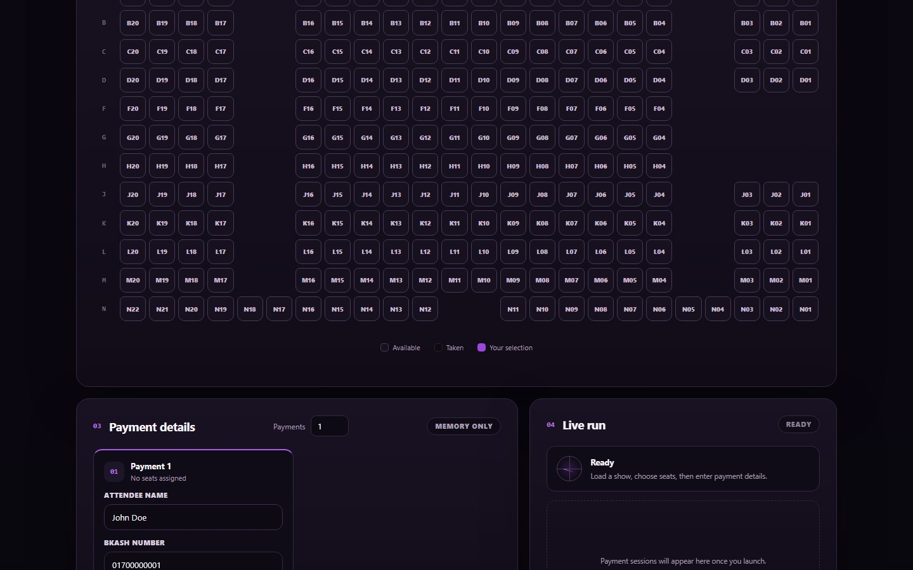
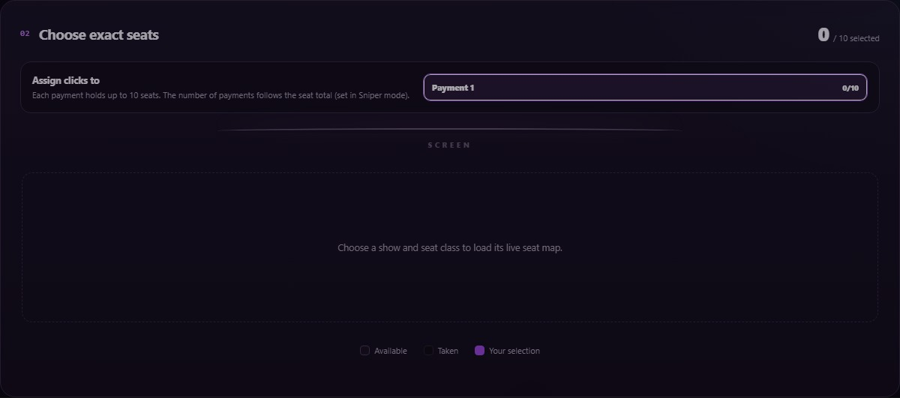
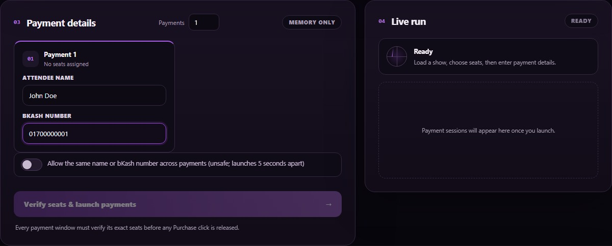
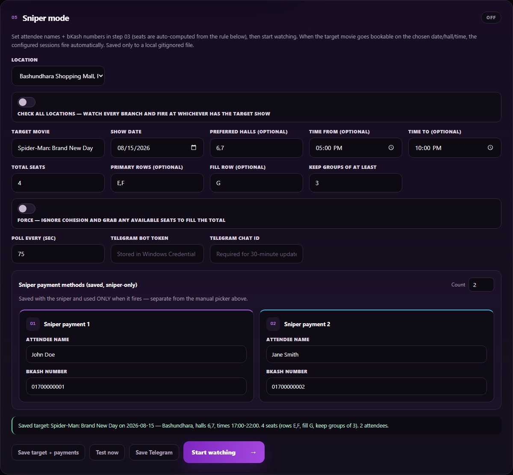
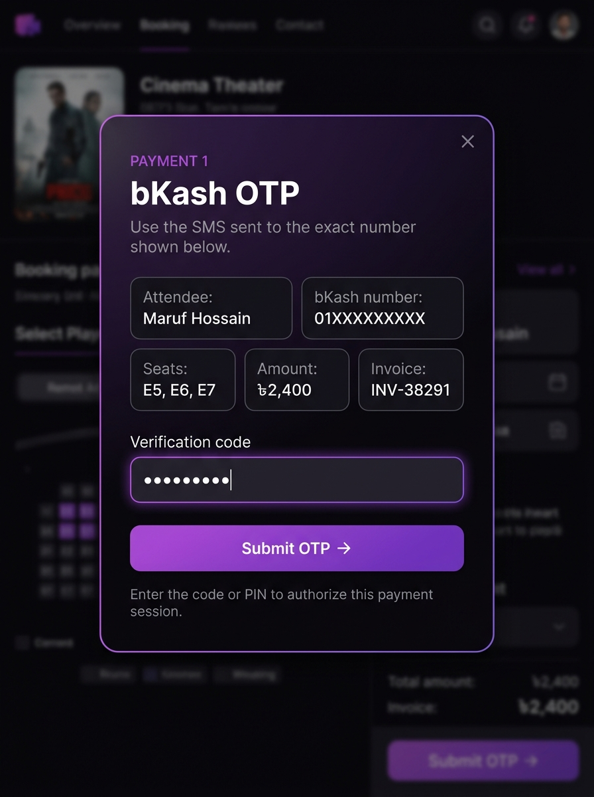
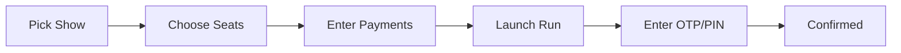

<p align="center">
  
</p>

<h1 align="center">CineBot</h1>

<p align="center">
  <b>STAR Cineplex Group Booking Console</b><br/>
  <sub>Pick every seat. Coordinate every payment. Move together.</sub>
</p>

<p align="center">
  
  
  
  
  
</p>

---

A local Windows application for booking STAR Cineplex shows as a group — select a live show, choose exact seats across a visual seat map, then run up to **8 synchronized bKash payment sessions** from a single control page.

It also includes a **Sniper mode** that watches the Cineplex schedule and automatically fires a group booking the instant a target show becomes available.

> **This is not a background payment bot.** CineBot uses real, visible browser windows. You must be present to review each payment, enter the bKash OTP, and confirm with your own PIN.

---

## Features

<table>
<tr>
<td width="50%" valign="top">

### Live Show Picker
- Browse the real-time Cineplex catalogue — locations, dates, movies, halls, showtimes, and seat classes
- All data pulled live from the STAR Cineplex schedule
- Cascading dropdowns with instant show summaries

### Interactive Seat Map
- Full visual seat map rendered from the live layout
- Color-coded session assignment — assign seats to different payment groups
- Up to 10 seats per payment, up to 8 payments per run (40 seats total)
- Real-time availability: taken seats are grayed out

### Synchronized Group Payments
- Each payment session runs in an isolated browser context
- Parallel bKash payment flows with serialized seat holds
- OTP/PIN entry via a local modal — no credentials are stored

</td>
<td width="50%" valign="top">

### Sniper Mode
- Poll the schedule at configurable intervals (15s–10min)
- Auto-fire when a target movie/date/hall/time becomes bookable
- Smart seat allocation: cohesive blocks, row preferences, tolerance controls
- Survives server restarts via persistent local state

### Telegram Notifications
- Real-time status updates every 30 minutes while watching
- Instant alerts when a match is found or an error occurs
- Credentials stored securely in Windows Credential Manager

### Privacy and Security
- bKash PINs and CVVs are **never** requested, saved, or typed by CineBot
- OTPs exist in process memory only during the active run
- Each payment uses a separate, isolated browser context
- Watcher config saved to a local gitignored file

</td>
</tr>
</table>

---

## Interface

### Live Show Picker

Select location, date, movie, hall, showtime, and seat class — all from live Cineplex data. The schedule summary updates instantly as you make selections.

<p align="center">
  
</p>

---

### Interactive Seat Map

Click individual seats on the live cinema layout. Each payment session gets its own color — purple, cyan, orange, green, pink, yellow, teal, coral — so you can visually track which seats belong to which payment.

<p align="center">
  
</p>

---

### Payment Details and Live Run

Enter attendee names and bKash numbers for each payment session (left panel). Once launched, the right panel shows real-time status for every session — navigating, waiting for OTP, completed, or failed — with timestamped event logs.

<p align="center">
  
</p>

---

### Sniper Mode

Configure a target movie, date, preferred halls, time range, seat allocation rules, and Telegram notifications. The sniper polls the schedule and fires the group booking automatically when a match drops.

<p align="center">
  
</p>

---

### OTP Verification

When a payment session reaches bKash, a modal appears showing the attendee, seats, amount, and invoice. Enter the SMS code here — the bot types it into the browser for you.

<p align="center">
  
</p>

---

## Tech Stack

| Layer | Technology |
|---|---|
| **Backend** | [FastAPI](https://fastapi.tiangolo.com/) + [Uvicorn](https://www.uvicorn.org/) |
| **Browser Automation** | [Playwright](https://playwright.dev/python/) + [playwright-stealth](https://github.com/nicespread/playwright-stealth) |
| **HTTP Client** | [curl-cffi](https://github.com/yifeikong/curl-cffi) (TLS fingerprint impersonation) |
| **Frontend** | Vanilla HTML/CSS/JS — dark glassmorphic UI with Inter font |
| **Real-time** | Server-Sent Events (SSE) via [sse-starlette](https://github.com/sysid/sse-starlette) |
| **Notifications** | [python-telegram-bot](https://python-telegram-bot.org/) |
| **Credential Storage** | [keyring](https://github.com/jaraco/keyring) (Windows Credential Manager) |
| **Validation** | [Pydantic](https://docs.pydantic.dev/) v2 |
| **Config** | [python-dotenv](https://github.com/theskumar/python-dotenv) + [pydantic-settings](https://docs.pydantic.dev/latest/concepts/pydantic_settings/) |

---

## Requirements

- **Windows 10** or **11**
- **Python 3.11** or later — [download here](https://www.python.org/downloads/) (enable "Add Python to PATH")
- **Google Chrome** (recommended — used as the primary browser)
- An internet connection
- A valid STAR Cineplex / bKash account and consent from every attendee

---

## Getting Started

### First-time setup

```powershell
# Clone the repository
git clone https://github.com/MEmio3/CheatCode.git
cd CheatCode

# Create and activate a virtual environment
python -m venv .venv
.\.venv\Scripts\Activate.ps1

# Install dependencies
python -m pip install --upgrade pip
python -m pip install -e ".[dev]"

# Install the browser binary (one-time)
python -m playwright install chromium
```

If PowerShell blocks activation, use the venv Python directly:

```powershell
.\.venv\Scripts\python.exe -m pip install -e ".[dev]"
.\.venv\Scripts\python.exe -m playwright install chromium
```

### Start the app

**Option A — One-click launcher** (recommended):

```powershell
.\start.bat
```

`start.bat` handles everything — checks Python, installs missing dependencies, clears stale servers on port 8765, and opens the browser automatically.

**Option B — Manual start:**

```powershell
python -m cinebot.ui.app_v2
```

Then open **[http://127.0.0.1:8765](http://127.0.0.1:8765)**. Keep the terminal open; press `Ctrl+C` to stop.

---

## How to Use

### Booking flow



1. **Pick a show** — Select location, date, movie, hall/showtime, and seat class. All data is live from STAR Cineplex.

2. **Choose seats** — Click individual seats on the interactive map. Assign them to payment sessions using the color-coded tabs (up to 10 seats per session).

3. **Enter payment details** — Provide attendee name and bKash number for each payment session. Data stays in memory only — nothing is saved.

4. **Launch** — Click **"Verify seats & launch payments"**. CineBot opens isolated Chrome windows, rechecks seat availability, and processes each payment.

5. **Authorize** — When each session reaches bKash, a modal pops up asking for the OTP (sent via SMS). Enter it, then confirm the PIN in the bKash browser window.

6. **Confirmation** — Wait for the page to show a confirmed payment for every session.

> If a seat becomes unavailable or a show changes before purchase, the run stops with an error. CineBot never silently substitutes seats.

### Sniper mode

1. Open the **Sniper mode** panel (Step 05) and configure the target movie, date, preferred halls, time range, total seats, row preferences, and attendee details.

2. Click **Save target + payments**, review, then click **Start watching**.

3. CineBot polls the schedule at your configured interval. When a match appears, it computes the optimal seat plan and fires the group booking automatically.

4. Save your Telegram bot token and chat ID to receive status updates every 30 minutes and instant alerts on match/error.

### Seat allocation

| Mode | Behavior |
|---|---|
| **Default** | Finds the most cohesive block — single unbroken run if possible |
| **Multi-row** | Balanced blocks across adjacent rows (e.g. 6+5, then 7+4) |
| **Tolerance** | Sets the smallest fragment treated as a group; smaller ones are avoided |
| **Force** | Ignores cohesion — grabs the first N available seats |

---

## Configuration

### Environment variables

Copy `.env.example` to `.env` and fill in the values:

```env
# Optional Telegram notifications for the sniper watcher
telegram_bot_token=123456:replace-with-your-token
userID=replace-with-your-chat-id

# Browser mode: true (headless, background) or false (visible Chrome window)
CINEBOT_HEADLESS=true
```

### Credential helper

Manage optional integration credentials with the OS keyring:

```powershell
python -m cinebot.config_store set     # Store a credential
python -m cinebot.config_store show    # Show stored credentials
python -m cinebot.config_store backend # Show the active keyring backend
```

The helper **refuses** to store bKash PINs, CVVs, and passwords.

### Sniper config

Watcher settings are saved to the local, gitignored `snipe_config.json`. Remove this file to clear saved watcher details.

---

## Project Structure

```
CheatCode/
├── cinebot/
│   ├── ui/
│   │   ├── app_v2.py            # FastAPI server + API endpoints
│   │   ├── app.py               # Legacy Hall-6 fixed flow
│   │   └── static/
│   │       ├── picker.html      # Main UI page
│   │       ├── picker.js        # Client-side logic + SSE
│   │       └── picker.css       # Dark glassmorphic design system
│   ├── live/
│   │   ├── catalog.py           # Read-only Cineplex catalog over HTTP
│   │   ├── group_booking.py     # Browser-driven booking + bKash flow
│   │   ├── group_run.py         # Multi-session orchestrator
│   │   ├── auth.py              # Guest login + session management
│   │   └── probe.py             # API booking probe (shelved)
│   ├── seats/
│   │   └── scorer.py            # Seat cohesion scoring + allocation
│   ├── recon/
│   │   └── capture.py           # API surface recorder
│   ├── sniper.py                # Release watcher + seat plan engine
│   ├── browse.py                # Shared browser utilities
│   ├── config_store.py          # OS keyring credential manager
│   ├── group.py                 # Group plan validation
│   ├── steps.py                 # OTP purpose definitions
│   ├── timer.py                 # Booking deadline tracker
│   ├── events.py                # SSE event bus
│   └── flow.py                  # Booking flow state machine
├── docs/
│   ├── HOW_IT_WORKS.md          # Architecture deep-dive
│   ├── api-map.md               # Observed Cineplex API surface
│   └── screenshots/             # UI screenshots
├── tests/                       # Test suite
├── start.bat                    # One-click launcher
├── pyproject.toml               # Project config + dependencies
├── requirements.txt             # Pinned dependencies
├── snipe_config.json            # Sniper state (gitignored)
└── .env.example                 # Environment template
```

---

## Tests

Install the development dependencies during setup, then run:

```powershell
python -m pytest -q
```

---

## Troubleshooting

| Problem | Solution |
|---|---|
| `python` is not recognized | Install Python 3.11+ from [python.org](https://www.python.org/downloads/) and enable **Add Python to PATH**, then open a new terminal |
| Browser launch fails | Run `python -m playwright install chromium`; installing/updating Chrome is also recommended |
| The page won't open | Confirm the terminal reports the server is running, then visit `http://127.0.0.1:8765`. Stop any stale instance with `Ctrl+C` or use `start.bat` |
| Catalogue or seat-map request fails | Check your connection, retry shortly, verify the show is published. Site-side rate limits or challenges can prevent the live flow |
| A selected seat is rejected | Refresh the live seat map and choose seats again. CineBot intentionally does not substitute seats |
| No OTP prompt appears | Check the matching visible bKash browser window for an error or cancellation. Do not reuse OTPs across sessions |
| Sniper not resuming after restart | Ensure `snipe_active.json` exists alongside `snipe_config.json` |

---

## Privacy and Security

- **bKash PINs and card CVVs** are never requested, saved, or typed by CineBot
- **OTPs**, names, and payment numbers entered during a run remain in **process memory only**
- Watcher settings (including attendee names and bKash numbers) are saved to `snipe_config.json` — a **local, gitignored** file
- Optional credentials use the **Windows Credential Manager** via `keyring`; fallback storage is `~/.cinebot/creds.json`
- Each browser payment session uses a **separate browser context** — verify attendee, seats, amount, and invoice before authorizing

---

## CLI Reference

| Command | Description |
|---|---|
| `python -m cinebot.ui.app_v2` | Start the main server (current picker + sniper UI) |
| `python -m cinebot.ui.app` | Start the legacy Hall-6 fixed flow |
| `python -m cinebot.config_store set` | Store a credential in the OS keyring |
| `python -m cinebot.config_store show` | Display stored credentials |
| `python -m cinebot.config_store backend` | Show the active keyring backend |
| `python -m cinebot.recon.capture` | Run the API recon/capture tool |

---

## Disclaimer

Use this project **only for legitimate ticket purchases** and only where automated interaction is permitted by the relevant service terms. The authors are not responsible for misuse.

---

<p align="center">
  Made with popcorn for the movie gang
</p>
